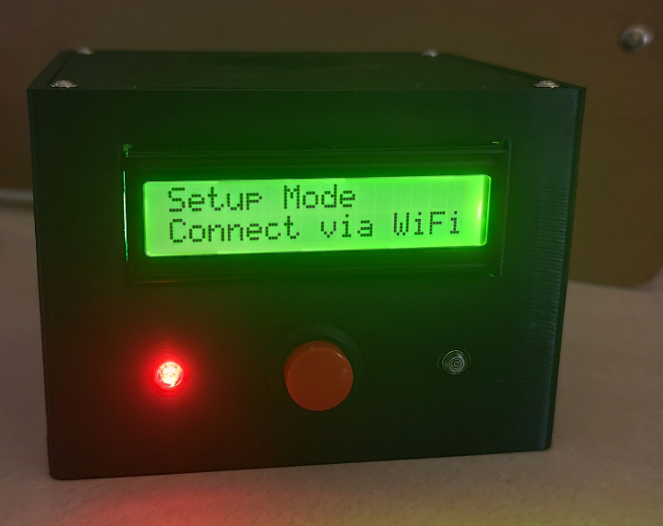
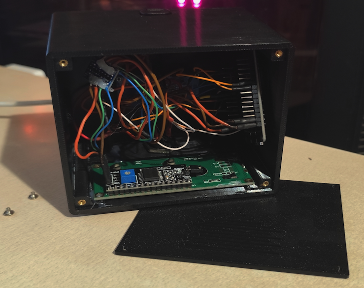
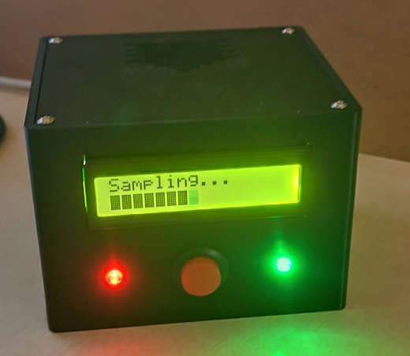
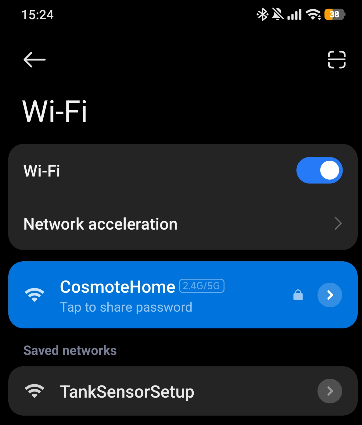
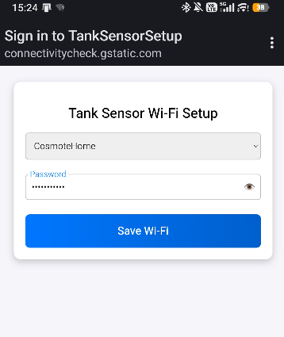
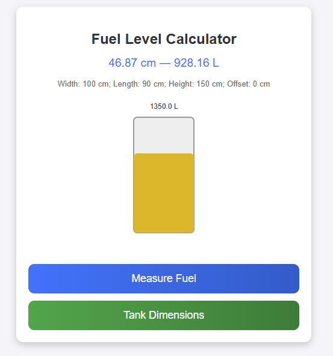
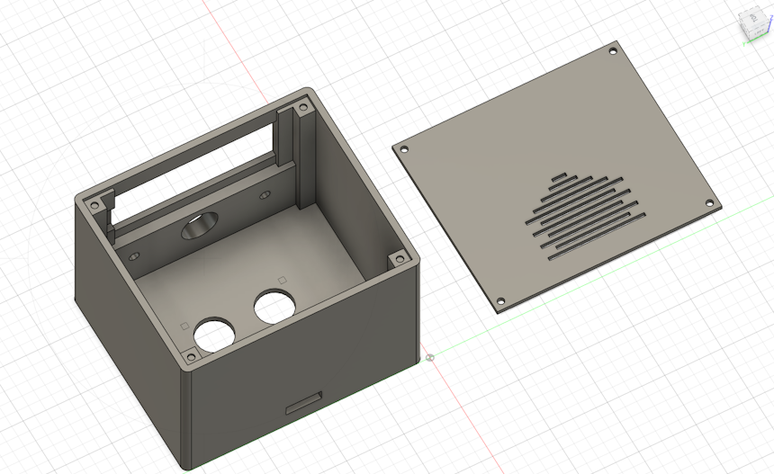

# Tank Level Monitor (Powered by ESP32)



An ESP32-based tank level monitoring system that uses an **HC-SR04 ultrasonic sensor** to measure the distance to the liquid surface and calculate the current fuel or liquid level in a rectangular tank.

The project combines a **local hardware interface** with a **self-hosted Wi-Fi dashboard**. Measurements can be triggered either remotely from the dashboard or locally using the physical button on the device.

## Motivation
Having a heating-fuel tank in my garden lacking any built-in level gauge, I decided to design an electronic device capable of measuring the remaining fuel level.
As the project evolved, I added remote access through the local network and adopted a contactless ultrasonic sensor, avoiding the need for a sensing element to come into direct contact with the fuel. I also retained the LCD so that measurements and device status remain available locally without requiring a phone or computer.

## Features

- ESP32-based
- Combines a self-hosted web dashboard with a physical display
- Wi-Fi configuration through a captive portal
- Persistent Wi-Fi credential storage
- Persistent configuration of rectangular tank dimensions
- 10-sample median filtering for more stable measurements
- HC-SR04 ultrasonic sensor for contactless fuel-level measurements
- 16×2 I²C LCD
- USB-C powered operation

## Software Structure

### `tankSensor.ino`

Main application entry point.

Initializes the hardware and network, selects normal Wi-Fi mode or captive-portal mode, and runs the main web-server loop.

### `hardwareManager`

Responsible for:

- GPIO initialization
- LCD
- LEDs
- Buzzer
- Button handling
- Ultrasonic sensor
- Local measurement feedback

### `networkManager`

Responsible for:

- Wi-Fi credentials
- Wi-Fi connection
- Captive portal
- DNS server
- Web server startup
- mDNS
- Wi-Fi reset

### `tankManager`

Responsible for:

- Tank configuration
- Persistent tank settings
- Distance-to-liquid-height conversion
- Volume calculation
- Measurement sampling
- Median filtering

### `dashboardManager`

Responsible for:

- Dashboard routes
- Measurement requests
- JSON data endpoint
- Tank dimension configuration

### `webpages`

Contains the HTML/CSS/JavaScript used by the ESP32's web interface.

## Hardware Structure



### Components

| Component | Description | Connection |
|---|---|---|
| ESP32 Dev Module | Main controller | — |
| HC-SR04 | Ultrasonic distance sensor | TRIG: GPIO 4 · ECHO: GPIO 5 |
| 16×2 I²C LCD | Local status and measurement display (`0x27`) | SDA: Default I²C SDA · SCL: Default I²C SCL |
| Push button | Measurement / Wi-Fi reset control | GPIO 18 |
| Buzzer | Audible status feedback | GPIO 19 |
| Power LED | Indicates that the device is powered; always ON during operation | GPIO 33 |
| Status LED | Indicates device state and button activity | GPIO 32 |

> **Important:** The ESP32 uses 3.3 V GPIO logic. The LCD interface in this project is intended to use a logic-level shifter so that the ESP32 is not exposed to the LCD's 5 V logic.


> **Important:** The HC-SR04 commonly operates from 5 V and its **ECHO output can be 5 V**. The ESP32 GPIO is not 5 V tolerant so a logic-level shifter may be required in this sensor as well. 

## Local Interface and Controls

### LCD Display


The LCD provides local feedback without requiring a phone or computer.

#### Wi-Fi connected

```text
Connected to:
<Wi-Fi SSID>
```

#### No Wi-Fi connection

```text
Wi-Fi not found
Open setup portal
```

#### Captive portal mode

```text
Setup Mode
Connect via WiFi
```

#### Measurement

The LCD first displays the measured distance:

```text
Distance:
XX.XX cm
```

It then switches to:

```text
Volume:
XX.XX L
```

#### Invalid measurement

```text
Measurement:
INVALID
```

### LEDs

There are two LED-related outputs in the firmware.

#### Power LED

The power LED is connected to GPIO 33 and is enabled during hardware initialization.

#### Status LED

The status LED is connected to GPIO 32.

It is normally enabled and is used for additional device feedback:

- Slow blinking while the captive portal is active and the device is not connected to any Wi-Fi network
- Fast blinking while the physical button is held, to signal that network reset is being triggered
- Short flash after a measurement

### Button Behaviour

The push button uses `INPUT_PULLUP`, meaning the input is normally HIGH and is pulled LOW when the button is pressed.

#### Short press

A short press triggers a measurement.

If the tank has not yet been configured, the LCD displays:

```text
Please visit
tanksensor.local!
```

Otherwise, the device:

1. Displays a sampling animation.
2. Takes 10 ultrasonic samples.
3. Filters the measurements.
4. Updates the LCD.
5. Beeps for 120 ms.
6. Flashes the status LED.

#### Long press

Holding the button for **5 seconds** resets the stored Wi-Fi credentials and restarts the ESP32.

While the button is being held, the status LED rapidly blinks.

### Buzzer

The buzzer is connected to GPIO 19.

It is used for audible feedback:

- A 200 ms beep during hardware initialization
- A 120 ms beep after a measurement
- An 80 ms periodic beep while the Wi-Fi captive portal is active

## Wi-Fi Setup



On startup, the ESP32 loads previously saved Wi-Fi credentials from its non-volatile preferences storage.

It attempts to connect for up to **8 seconds**.

If the connection succeeds, the device starts the web dashboard and advertises itself through mDNS as:

```text
tanksensor.local
```

If the connection fails, the ESP32 starts a captive portal access point named:

```text
TankSensorSetup
```

The device then provides a Wi-Fi setup page where an available network can be selected and its password entered.

After saving the credentials, the ESP32 restarts and attempts to connect to the configured network.

## Web Dashboard



When connected to Wi-Fi, the dashboard is available at:

```text
http://tanksensor.local/
```

The dashboard displays:

- Current distance
- Current calculated volume
- Tank capacity
- Tank dimensions
- Tank fill visualization
- Measurement status

The browser polls the `/data` endpoint every second.

The dashboard also provides buttons for:

- **Measure Fuel**
- **Tank Dimensions**

### Web Endpoints

| Method | Endpoint | Purpose |
|---|---|---|
| GET | `/` | Main dashboard |
| GET | `/data` | Current measurement data as JSON |
| POST | `/measure` | Trigger a measurement |
| GET | `/dimensions` | Tank configuration page |
| POST | `/saveDimensions` | Save tank dimensions |
| GET | `/` in setup mode | Wi-Fi configuration |
| POST | `/save` in setup mode | Save Wi-Fi credentials |

### `/data`

The endpoint returns information including:

```json
{
  "text": "25.00 cm",
  "liters": "120.00 L",
  "liters_num": 120.00,
  "capacity_liters": 200.00,
  "tankConfigured": true,
  "width": 50.00,
  "length": 80.00,
  "height": 50.00,
  "offset": 5.00,
  "valid": 10
}
```

The values above are examples only.

## Persistent Configuration

The project uses the ESP32 `Preferences` system to retain settings across restarts.

Two groups of settings are stored:

### Wi-Fi

Stored values:

- SSID
- Password

### Tank

Stored values:

- Width
- Length
- Height
- Offset

This means that the tank configuration and Wi-Fi credentials do not need to be entered again after every reboot.


## Measurement Process

To improve measurement stability, the system does not rely on a single ultrasonic reading.

For each measurement, the ESP32 takes **10 samples**, with a **60 ms delay** between samples.

Invalid samples are discarded.

The remaining valid samples are sorted and the median is selected.

```text
10 ultrasonic readings
          │
          ▼
Discard invalid readings
          │
          ▼
Sort valid readings
          │
          ▼
Select median
          │
          ▼
Calculate liquid level
          │
          ▼
Calculate volume
```

A measurement is considered invalid when:

- No valid samples are obtained, or
- More than 5 of the 10 samples are invalid.

The ultrasonic measurement itself uses `pulseIn()` with a timeout of 20 ms.

Distances below **2 cm** are also rejected.

### Calculation

The tank is modelled as a **rectangular tank**.

The following dimensions are configured through the web interface:

- Width
- Length
- Height
- Sensor offset

All dimensions are entered in centimetres.

The sensor offset represents the distance between the ultrasonic sensor and the tank's top/reference point, allowing the sensor to be mounted above the tank itself.

The liquid height is calculated as:

```text
distance from sensor to liquid
        +
sensor offset
        =
distance from tank top to liquid

tank height
        -
distance from tank top to liquid
        =
liquid height
```

The liquid height is constrained between `0` and the configured tank height.

The volume calculation is:

```text
Volume (L) = Width × Length × Liquid Height / 1000
```

Tank capacity is calculated using:

```text
Capacity (L) = Width × Length × Tank Height / 1000
```

Because the dimensions are entered in centimetres, dividing the cubic-centimetre result by 1000 converts it to litres.

## Electronics Housing



To house the electronics, a simple enclosure was designed and 3D printed. The mechanical design is intentionally simple, as the main focus of the project is the firmware and electronics; the model is included primarily as a reference for the completed build.


## Safety & Electronics Notes

### Fire Hazard

Operating electronic equipment close to fuel or fuel vapours can present a serious fire or explosion hazard. This is a hobby project intended for supervised personal experimentation, not a certified fuel-level monitoring system. It should **not** be treated as intrinsically safe or left operating unattended near flammable vapours.

### ESP32 GPIO voltage

ESP32 GPIOs are **3.3 V logic** and should not receive 5 V signals.

### LCD

Many common I²C LCD backpack modules are powered from 5 V. In this build, a logic-level shifter is used between the LCD's I²C interface and the ESP32's 3.3 V GPIO.

### HC-SR04

Pay particular attention to the HC-SR04 **ECHO** output. If the sensor is operated at 5 V, the ECHO signal may also reach 5 V and must not be connected directly to the ESP32. Use a suitable voltage divider or level-shifting circuit.

### Power

The device is powered through USB-C. The ESP32 may be powered separately from the peripherals if required, provided that all parts of the circuit share a **common ground**. Use a stable USB power source with sufficient current capacity; a suitable USB power adapter is generally preferable to relying on a low-current computer USB port.

## Limitations

- The current volume calculation requires a rectangular tank.
- Measurements are based on ultrasonic sensing and can therefore be affected by the physical environment. However, sampling improves the results.
- The HC‑SR04 sensor is not waterproof, so prolonged exposure to fuel fumes can oxidize its components over time. However, better sensor options do exist, and thanks to the offset, the sensor can be positioned well above the fuel level.

## Troubleshooting

### The LCD does not display anything

Check:

- Display wiring and supply voltage, as many I²C LCD modules require 5 V
- Logic-level shifter wiring
- I²C address

The firmware currently uses:

```text
0x27
```

Different LCD backpack modules may use a different I²C address, so scan the I²C bus if the display is not detected.

### The ESP32 cannot measure the tank

Check:

- HC-SR04 wiring and supply voltage; verify the requirements of the specific sensor module
- Sensor positioning

### `tanksensor.local` does not open

Make sure:

- The ESP32 successfully connected to Wi-Fi.
- The computer/phone is on the same local network.
- The ESP32 has not fallen back to `TankSensorSetup` mode.

The device can also be accessed through its IP address when necessary.

### The measurement is invalid

The firmware considers a reading invalid when the ultrasonic timeout expires or the measured distance is below 2 cm.
The overall measurement is rejected if no valid samples are obtained or more than half of the ten samples are invalid.

---
